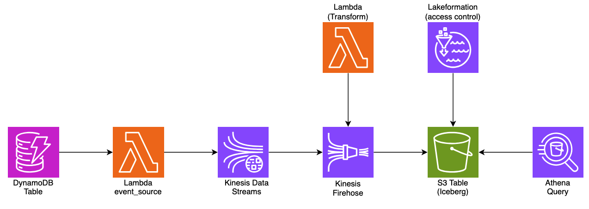

# Stream DynamoDB data to S3 Tables using Kinesis Firehose Delivery
This sample illustrates an approach on how to stream data from DynamoDB table to S3 Tables in near real-time using Amazon Kinesis Stream and Kinesis Firehose. Once the data is in S3 Tables, it can be queried using Athena for your analytics purposes. 



### Components
List of AWS Services used in this sample
- **S3 Tables**: This is the core and centre piece of this sample. Data is ingested through Firehose and then queried using Athena.
- **Kinesis Firehose**: Receives the data from Kinesis Data Stream and pushes to S3 Tables
- **Kinesis Stream**: Pushing the data from DynamoDB table to Kinesis Firehose
- **DynamoDB**: Source database for streaming the data to S3 Tables. We will insert records in DynamoDB table which will flow through to S3 Tables via Kinesis Data Stream and Firehose
- **Lambda**: Lambda is used for data formation and also for providing access to Lakeformation which allows Athena to access the namespace and 
- **Athena**: This is used to query the data which are pushed to S3 Tables from DynamoDB via Kinesis Firehose and Data Streams.


### Clone the repo 
```
git clone https://github.com/aws-samples/sample-for-transactional-datalake-using-s3tables.git
```

### Step 1: Setup your python development environment using say VS Code IDE.

```
cd sample-for-transactional-datalake-using-s3tables/kinesis-firehose-stream

python3 -m venv .venv

source .venv/bin/activate

sudo npm install -g aws-cdk

pip install -r requirements.txt

```

### Step 2: Build the Lambda layers for boto3 SDK 
We need to follow this step until Lambda by default picks up the latest boto3 release that support s3tables. 

```
mkdir boto3-layer

pip install -r requirements-layers.txt -t boto3-layer/python

```

### Step 3: Deploy the upstream pipeline resources

Next let us provison all the pipeline resources : 
- DynamoDB Table
- Kinesis Data Streams
- Lambda to process stream
- Lambda as custom resource to create S3 Table Bucket, Namespace & Table. 

At this point you can now synthesize the CloudFormation template for this code.

```
cdk synth
```
Note : If you encounter "RuntimeError: Cannot find module '@aws-cdk/cx-api'", then follow the below steps : 
```
# Remove existing CDK packages
pip uninstall aws-cdk.cx-api aws-cdk-lib -y

# Clear pip cache
pip cache purge

# Reinstall dependencies
pip install -r requirements.txt
```
Bootstrap your CDK env to the desired AWS account and region where S3 Tables is available

```
cdk bootstrap 111111111111/us-east-1
```

Customize the cdk context variables in cdk.context.json if required.

```
{
  "table_bucket_name": "streamtablebucket",
  "table_name": "streamtable",
  "namespace": "streamnamespace",
  "bucket_name": "streanbucket"
}
```

Deploy the pipeline resources
```
cdk deploy PipelineStack
```

### Step 4: Deploy Lakeformation permissions 

You need to Grant permissions to the S3 Table using LakeFormation (LF) and the role. This will LF enough permission to access the S3 Tables namespace and tables

```
cdk deploy LakeFormationStack
```

### Step 5: Connect Firehose to S3 Table
Create Firehose stream and push the data in near-realtime to S3 Table which are created in the earlier section

```
cdk deploy FirehoseStack
```

### Step 6: Update metadata location for the s3tables

You can access S3 tables from open source query engines by using the Amazon S3 Tables Catalog for Apache Iceberg client catalog. This means you need to create an Amazon EMR cluster with Apache Iceberg installed and initiate an [Apache Spark session](https://docs.aws.amazon.com/AmazonS3/latest/userguide/s3-tables-getting-started.html). Then, using Spark, you can create a namespace and a table in your table bucket, and add data to your table. You can either query your table within the Amazon EMR cluster or use Amazon Athena or Amazon Redshift to query your table.

Currently S3 Tables does not provide SDK/CLI capabilities to create a table with metadata & columns in it directy. The table (streamtable) created using CDK does not have any columns/attributes. Now, we will use the following steps to add metadata & columns to table (streamtable) instead of using an Apache Spark session.

Ensure that the principal (User or Role) has permissions to access the below AWS resources to complete the remaining steps : 
- S3 Tables
- Glue 
- Athena 

Also grant lakeformation permissions to the principal (User or Role) that needs to query the table. (Update the account id and user)

```
aws lakeformation grant-permissions \
  --principal '{"DataLakePrincipalIdentifier": "arn:aws:iam::123456789012:user/johndoe"}' \
  --resource '{"Table": {"CatalogId": "123456789012:s3tablescatalog/streamtablebucket", "DatabaseName": "streamnamespace", "Name": "streamtable"}}' \
  --permissions SELECT DESCRIBE 
```
You have two options to update the metadata: 
1. Using the automated script :  scripts/update_metadata.py
Note : Update the variable 'athena_output_location' before running the script. 
```
python3 scripts/update_metadata.py
```

2. Manually by following the below steps using CLI. 

Navigate to AWS CloudShell and follow the steps below:

#### 6a: Get warehouse location & version token
First we need to get the warehouse location of the table (streamtable) we have created through CDK. Please replace the AWS Account ID and region in the following command:

```
aws s3tables get-table --table-bucket-arn arn:aws:s3tables:<<us-east-1>>:<<111111111111>>:bucket/streamtablebucket --namespace streamnamespace  --name streamtable
```
Note the following details:
"warehouse_location": "s3://f063a63c-xxxx-xxxx-xxxxxxxxxxxxx--table-s3"
"versionToken": "xxxxxxxxxxxxx"

#### 6b: Create a temporary table
Navigate to Athena and select "default" database. Now create a temp table with the desired defintion. In this example, we have created a table (temptable) with the columns id, name and the metadata like location and table properties. Change the schema as per your up-stream table that you are streaming from. 

```
CREATE TABLE default.temptable(id string, name string) LOCATION '<<warehouse_location>>' TBLPROPERTIES ( 'table_type'= 'ICEBERG' )

```

#### 6c: Get Table metadata location
Navigate to CloudShell. Lets get the metadata location of the temporary table 'default.temptable'.

```
aws glue get-table --catalog-id <<AWS-ACCOUNT-ID>> --database-name default --name temptable

```
Note the metadata location
 "metadata_location": "s3://f063a63c-xxxx-xxxx-xxxxxxxxxxxxx--table-s3/metadata/xxxxxxxxxxxx.metadata.json"

#### 6d: Update metadata location 
Now update the metadata location for the S3 table (streamtable) we created using CDK. You will need the metadata location and versionToken that you noted down in step 6a.

```
aws s3tables update-table-metadata-location --table-bucket-arn arn:aws:s3tables:<<us-east-1>>:<<111111111111>>:bucket/streamtablebucket --namespace streamnamespace  --name streamtable --version-token xxxxxx --metadata-location s3://f063a63c-xxxx-xxxx-xxxxxxxxxxxxx--table-s3/metadata/xxxxxxxxxxxx.metadata.json

```
Now, check the table (streamtable) in the Athena console and we will be able to see the columns (id string, name string).

### Step 7: Testing the data flow from DynamoDB to s3tables

Let us insert some items into the DynamoDB Table using the following command. 

```
aws dynamodb put-item \
    --table-name sourcetable  \
    --item \
        '{"id": {"S": "1000"}, "name": {"S": "dynamo"}}'

```

### Step 8: Verify the streamed data
Using Athena Console or CLI you can query the streamed data from S3 Tables (streamtable)

```
aws athena start-query-execution \
    --query-string "SELECT * FROM streamtable limit 10" \
    --work-group "AthenaAdmin" \
    --query-execution-context Database=streamnamespace,Catalog=s3tablecatalog/streamtablebucket Datasource=AwsDataCatalog
```

Now you can run your transactional anlytics queries against your S3 Tables. 


### Step 9: Clean up
Delete the resources to avoid unexpected costs.

```
cdk destroy --all
```

Note : You can tune the Buffer hints configuration of the Firehose delivery stream to control the buffer size and buffer interval to optimize the time it takes for the source event to reach te destination S3 table. 


To add additional dependencies, for example other CDK libraries, just add
them to your `setup.py` file and rerun the `pip install -r requirements.txt`
command.

### Useful commands

 * `cdk ls`          list all stacks in the app
 * `cdk synth`       emits the synthesized CloudFormation template
 * `cdk deploy`      deploy this stack to your default AWS account/region
 * `cdk diff`        compare deployed stack with current state
 * `cdk docs`        open CDK documentation

Enjoy!
