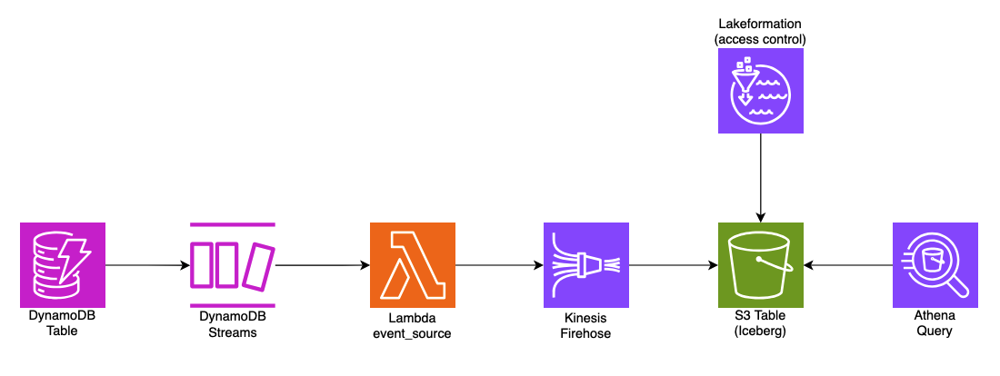
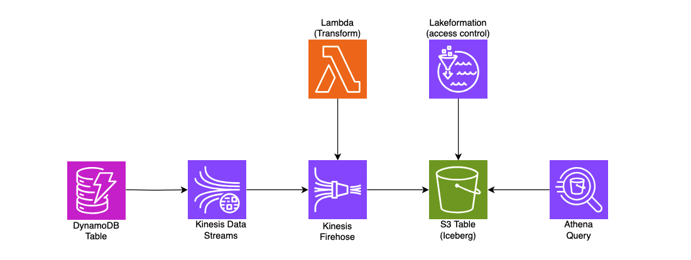

# Stream DynamoDB data to S3 Tables using Kinesis Firehose Delivery
This sample illustrates an approach on how to stream data from DynamoDB table to S3 Tables in near real-time using either DynamoDB Streams or Amazon Kinesis Data Streams with Kinesis Firehose. Once the data is in S3 Tables, it can be queried using Athena for your analytics purposes.

### Using DynamoDB Streams


### Using Kinesis Streams



### Components
List of AWS Services used in this sample
- **S3 Tables**: This is the core and centre piece of this sample. Data is ingested through Firehose and then queried using Athena.
- **Kinesis Firehose**: Receives the data from either DynamoDB Streams or Kinesis Data Stream and pushes to S3 Tables
- **Kinesis Data Stream**: Optional component that can be used for pushing the data from DynamoDB table to Kinesis Firehose
- **DynamoDB**: Source database for streaming the data to S3 Tables. We will insert records in DynamoDB table which will flow through to S3 Tables via either DynamoDB Streams or Kinesis Data Stream and Firehose
- **Lambda**: Several Lambda functions are used in the architecture:
  - **Transform Lambda**: Processes and transforms data from Kinesis before it reaches Firehose (when using Kinesis Data Streams)
  - **Firehose Lambda**: Processes DynamoDB Stream events and forwards them to Firehose (when using DynamoDB Streams)
  - **Custom Resource Lambda**: Creates and manages S3 Table resources
- **Athena**: This is used to query the data which are pushed to S3 Tables from DynamoDB via Kinesis Firehose.


### Clone the repo 
```
git clone https://github.com/aws-samples/sample-for-transactional-datalake-using-s3tables.git
```

### Step 1: Setup your python development environment using an IDE e.g. VS Code.

```
cd sample-for-transactional-datalake-using-s3tables/kinesis-firehose-stream

python3 -m venv .venv

source .venv/bin/activate

sudo npm install -g aws-cdk

pip install -r requirements.txt

```

### Step 2: Build the Lambda layers for boto3 SDK 
These steps are required until Lambda by default picks up the latest boto3 release that supports S3 Tables. 

```
mkdir boto3-layer

pip install -r requirements-layers.txt -t boto3-layer/python

```

### Step 3: Deploy the upstream pipeline resources

At this point, you can now synthesize the CloudFormation template for this code.

```
cdk synth
```

Bootstrap your CDK env to the desired AWS account and [region where S3 Tables is available](https://docs.aws.amazon.com/AmazonS3/latest/userguide/s3-tables-regions-quotas.html)

```
cdk bootstrap 111111111111/us-east-1
```

We will create the following table bucket, table, namespace and S3 bucket. For custom configurations, you can modify the variables in cdk.context.json to align with your specific requirements.

```
{
  "table_bucket_name": "streamtablebucket",
  "table_name": "transactions",
  "namespace": "analytics",
  "bucket_name": "streambucket",
  "stream_type": "dynamodb"
}
```

The `stream_type` property determines which streaming architecture to deploy:
- `kinesis`: Uses Kinesis Data Streams with a Lambda processor for data transformation
- `dynamodb`: Uses DynamoDB Streams directly with a Lambda function to forward events to Firehose

Next let us provision all the pipeline resources:

```
cdk deploy PipelineStack
```

This will create:
- DynamoDB table as source data
- Lambda as custom resource to create S3 Table Bucket, Namespace & Table
- Based on the `stream_type` property in cdk.context.json:
  - If `kinesis`: Creates a Kinesis Data Stream and configures DynamoDB to stream changes to it
  - If `dynamodb`: Enables DynamoDB Streams on the table

### Step 4: Deploy Lakeformation permissions 

Now, we need to Grant permissions to the S3 Table using LakeFormation (LF) and the role. This will give LF enough permission to access the S3 Tables namespace and tables

```
cdk deploy LakeFormationStack
```

### Step 5: Connect Firehose to S3 Table
Create Firehose stream and push the data to S3 Table which are created in the earlier section

```
cdk deploy FirehoseStack
```

This will create:
- Kinesis Firehose delivery stream configured to write to S3 Tables
- Based on the `stream_type` property in cdk.context.json:
  - If `kinesis`: Creates a Lambda function for transforming Kinesis data and configures Firehose to use Kinesis as source with this Lambda for data processing
  - If `dynamodb`: Creates a Lambda function to process DynamoDB Stream events and forward them to Firehose using Direct PUT

### Step 6: Testing the data flow from DynamoDB to s3tables

Let us insert some items into the DynamoDB Table using the following script. 

```
python3 scripts/create_sample_data.py

```

### Step 7 : Grant LakeFormation permissions 

Grant lakeformation permissions to the principal (user or role) that needs to query the table.

```
aws lakeformation grant-permissions 
      --principal '{"DataLakePrincipalIdentifier": "arn:aws:iam::<<123456789012>>:user/<<johndoe>>"}' \
      --resource '{"Table": {"CatalogId": "<<123456789012>>:s3tablescatalog/streamtablebucket", "DatabaseName": "analytics", "Name": "transactions"}}' \
      --permissions SELECT DESCRIBE 
```


### Step 8: Verify the streamed data
Using Athena Console or CLI you can query the streamed data from S3 Tables (transactions). Replace the 'work-group' value with the name in your setup. Also, ensure that workgroup has already setup an output location (S3 bucket). Alternatively you can also provide the output location as part of the below query at the end like --result-configuration "OutputLocation=s3://your-bucket/query-results/". Please make sure the user has the permission to write to the S3 bucket.

```
aws athena start-query-execution \
      --query-string "SELECT * FROM transactions LIMIT 100" \
      --work-group "primary" \
      --result-configuration "OutputLocation=s3://bucket-name/query-results/" \
      --query-execution-context "Database=analytics,Catalog=s3tablescatalog/streamtablebucket"
```
Note the QueryExecutionId from the ouput of the above query and run the following query to see the content of the query.
    {
        "QueryExecutionId": "08cf4d54-b66a-448a-a62d-a4ca0cd7fb86"
    }

```
aws athena get-query-results --query-execution-id 0441f638-41c5-42d6-93e4-c8c3e750b7d5 --output json
```

Alternatively, if you have access to the Athena console, you can run the query after choosing the appropriate Data source, Catalog and Database. In this example, it would be the following:
Data source: AwsDataCatalog
Catalog: s3tablescatalog/streamtablebucket
Database: analytics


Below are some examples of analytics query that you might want to run against your financial transactions data. 

```
-- Risk Analysis by Region and Merchant Category:

SELECT 
    region,
    merchant_category,
    date,
    COUNT(*) as total_transactions,
    SUM(CAST(amount AS DECIMAL(12,2))) as total_amount,
    COUNT(CASE WHEN risk_score = 'HIGH' THEN 1 END) as high_risk_count,
    COUNT(CASE WHEN velocity_check = 'FLAG' THEN 1 END) as velocity_flags,
    COUNT(CASE WHEN status = 'FLAGGED' THEN 1 END) as flagged_transactions
FROM transactions
WHERE date >= CURRENT_DATE - INTERVAL '7' DAY
GROUP BY region, merchant_category, date
HAVING COUNT(CASE WHEN risk_score = 'HIGH' THEN 1 END) > 0
ORDER BY high_risk_count DESC;

```

```
-- Hourly Transaction Pattern Analysis:

SELECT 
    date,
    hour,
    merchant_category,
    payment_method,
    COUNT(*) as transaction_count,
    SUM(CAST(amount AS DECIMAL(12,2))) as total_amount,
    COUNT(DISTINCT customer_id) as unique_customers,
    COUNT(CASE WHEN status = 'DECLINED' THEN 1 END) as declined_count,
    COUNT(CASE WHEN amount_threshold = 'HIGH' THEN 1 END) as high_amount_alerts
FROM transactions
WHERE date = CURRENT_DATE
GROUP BY date, hour, merchant_category, payment_method
ORDER BY hour, total_amount DESC;
```
Now you can run your analytics queries against your S3 Tables as your transactional lake. 

### Step 9: Clean up
Delete the resources to avoid unexpected costs. Empty the S3 bucket used for storing logs from Kinesis Data Firehose before destroying the stack .

```
cdk destroy --all
```

## Additional Configuration Options

### Switching Between Stream Types

To switch between using Kinesis Data Streams and DynamoDB Streams, update the `stream_type` property in `cdk.context.json`:

```json
{
  "stream_type": "kinesis"  // Use "kinesis" or "dynamodb"
}
```

After changing this value, run `cdk deploy` again to update your infrastructure.

### Lambda Functions

The solution uses several Lambda functions:

1. **Transform Lambda** (when using Kinesis): Processes base64-encoded data from Kinesis Firehose, extracts DynamoDB change events, and formats them for S3 Tables.

2. **Firehose Lambda** (when using DynamoDB Streams): Processes DynamoDB Stream events and forwards them to Kinesis Firehose.

3. **Custom Resource Lambda**: Creates and manages S3 Table resources during CDK deployment. If you need to manually create the S3 Table you can use the following CLI command using the sample tabledefinition.json file included in the repo. 

```
aws s3tables create-table --cli-input-json file://tabledefinition.json
``` 

### Buffer Configuration

You can tune the [buffer hints configuration](https://docs.aws.amazon.com/firehose/latest/dev/buffering.html) of the Firehose delivery stream to control the buffer size and buffer interval to optimize the time it takes for the source event to reach the destination S3 table.


To add additional dependencies, for example other CDK libraries, just add
them to your `setup.py` file and rerun the `pip install -r requirements.txt`
command.

### Useful commands

 * `cdk ls`          list all stacks in the app
 * `cdk synth`       emits the synthesized CloudFormation template
 * `cdk deploy`      deploy this stack to your default AWS account/region
 * `cdk diff`        compare deployed stack with current state
 * `cdk docs`        open CDK documentation

Enjoy!
