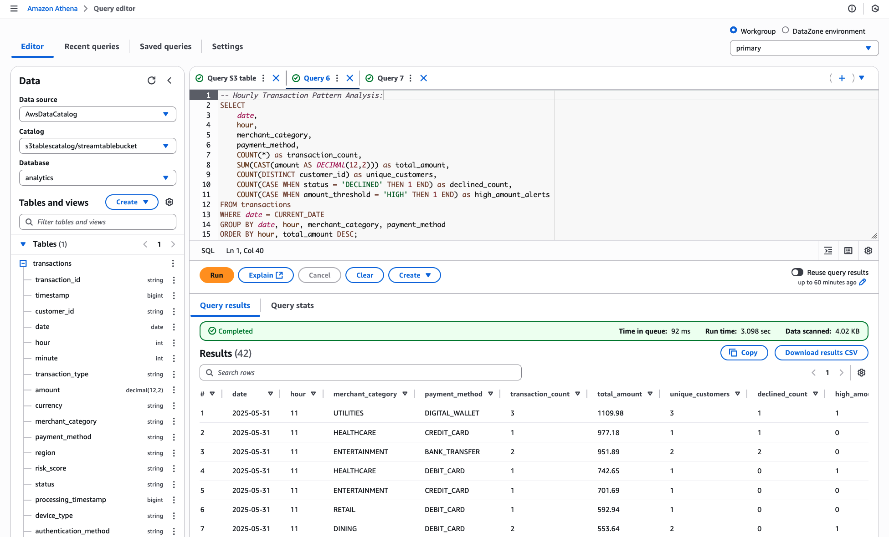

# Stream DynamoDB data to S3 Tables using Kinesis Firehose Delivery
This sample illustrates an approach on how to stream data from DynamoDB table to S3 Tables in near real-time using Amazon Kinesis Stream and Kinesis Firehose. Once the data is in S3 Tables, it can be queried using Athena for your analytics purposes. 


### Components
List of AWS Services used in this sample
- **S3 Tables**: This is the core and centre piece of this sample. Data is ingested through Firehose and then queried using Athena.
- **Kinesis Firehose**: Receives the data from Kinesis Data Stream and pushes to S3 Tables
- **Kinesis Stream**: Pushing the data from DynamoDB table to Kinesis Firehose
- **DynamoDB**: Source database for streaming the data to S3 Tables. We will insert records in DynamoDB table which will flow through to S3 Tables via Kinesis Data Stream and Firehose
- **Lambda**: Lambda is used for data formation and also for providing access to Lakeformation which allows Athena to access the namespace and 
- **Athena**: This is used to query the data which are pushed to S3 Tables from DynamoDB via Kinesis Firehose and Data Streams.


### Clone the repo 
```
git clone https://github.com/aws-samples/sample-for-transactional-datalake-using-s3tables.git
```

### Step 1: Setup your python development environment using an IDE e.g. VS Code.

```
cd sample-for-transactional-datalake-using-s3tables/kinesis-firehose-stream

python3 -m venv .venv

source .venv/bin/activate

sudo npm install -g aws-cdk

pip install -r requirements.txt

```

### Step 2: Build the Lambda layers for boto3 SDK 
These steps are required until Lambda by default picks up the latest boto3 release that supports S3 Tables. 

```
mkdir boto3-layer

pip install -r requirements-layers.txt -t boto3-layer/python

```

### Step 3: Deploy the upstream pipeline resources

At this point, you can now synthesize the CloudFormation template for this code.

```
cdk synth
```
Note : If you encounter "RuntimeError: Cannot find module '@aws-cdk/cx-api'", then follow the below steps and run 'cdk synth' again: 
```
# Remove existing CDK packages
pip uninstall aws-cdk.cx-api aws-cdk-lib -y

# Clear pip cache
pip cache purge

# Reinstall dependencies
pip install -r requirements.txt

# Run cdk synth again
cdk synth
```
Bootstrap your CDK env to the desired AWS account and [region where S3 Tables is available](https://docs.aws.amazon.com/AmazonS3/latest/userguide/s3-tables-regions-quotas.html)

```
cdk bootstrap 111111111111/us-east-1
```

We will create the following table bucket, table, namespace and S3 bucket. For custom configurations, you can modify the variables in cdk.context.json to align with your specific requirements.

```
{
  "table_bucket_name": "streamtablebucket",
  "table_name": "transactions",
  "namespace": "analytics",
  "bucket_name": "streanbucket"
}
```

Next let us provison all the pipeline resources : 
- DynamoDB table as source data
- Lambda to process stream from DynamoDB
- Kinesis Data Streams for near real time streaming.
- Lambda as custom resource to create S3 Table Bucket, Namespace & Table. 

```
cdk deploy PipelineStack
```

### Step 4: Deploy Lakeformation permissions 

Now, we need to Grant permissions to the S3 Table using LakeFormation (LF) and the role. This will give LF enough permission to access the S3 Tables namespace and tables

```
cdk deploy LakeFormationStack
```

### Step 5: Connect Firehose to S3 Table
Create Firehose stream and push the data to S3 Table which are created in the earlier section

```
cdk deploy FirehoseStack
```

### Step 6: Update metadata location for the s3tables

You can access S3 tables from open source query engines by using the Amazon S3 Tables Catalog for Apache Iceberg client catalog. This means you need to create an Amazon EMR cluster with Apache Iceberg installed and initiate an [Apache Spark session](https://docs.aws.amazon.com/AmazonS3/latest/userguide/s3-tables-getting-started.html). Then, using Spark, you can create a namespace and a table in your table bucket, and add data to your table. You can either query your table within the Amazon EMR cluster or use Amazon Athena or Amazon Redshift to query your table.

Currently S3 Tables does not provide SDK/CLI capabilities to create a table with metadata & columns in it directy. The table (transaction or the name you have provided in cdk.context.json) created using CDK does not have any columns/attributes. Now, we will use the following steps to add metadata & columns to table (transactions or the name you have provided) instead of using an Apache Spark session.

Ensure that the principal (User or Role) has permissions to access the below AWS resources to complete the remaining steps : 
- S3 Tables
- Glue 
- Athena 

Also grant lakeformation permissions to the principal (User or Role) that needs to query the table. (Update the account id at 2 places and user)

```
aws lakeformation grant-permissions 
      --principal '{"DataLakePrincipalIdentifier": "arn:aws:iam::<<123456789012>>:user/<<johndoe>>"}' \
      --resource '{"Table": {"CatalogId": "<<123456789012>>:s3tablescatalog/streamtablebucket", "DatabaseName": "analytics", "Name": "transactions"}}' \
      --permissions SELECT DESCRIBE 
```
**There are TWO options to update the metadata:**
<u>*Option 1: Automated using a script*</u>

Note : Update the variable 'athena_output_location' before running the script. 
```
python3 scripts/update_metadata.py
```
#### If you have executed the above script, Go to Step 7

<u>*Option 2: Manual Steps using AWS CLI*</u>

Navigate to AWS CloudShell and follow the steps below:

#### 6a: Get warehouse location & version token
First we need to get the warehouse location of the table (transactions) we have created through CDK. Please replace the AWS Account ID and region in the following command:

```
aws s3tables get-table \
    --table-bucket-arn arn:aws:s3tables:<<us-east-1>>:<<111111111111>>:bucket/streamtablebucket \
    --namespace analytics \
    --name transactions 
```
Note the following details:
"warehouse_location": "s3://f063a63c-xxxx-xxxx-xxxxxxxxxxxxx--table-s3"
"versionToken": "xxxxxxxxxxxxx"

#### 6b: Create a temporary table
Navigate to Athena and select "default" database. Now create a temp table with the desired definition. In this example, we have created a table (temptable) with the columns mapping the sample data that to be ingested into the source DynamoDB table. Change the schema as per your up-stream table that you are streaming from. 

```
CREATE TABLE IF NOT EXISTS default.temptable (
            -- Primary identifiers
            transaction_id STRING,
            timestamp BIGINT,
            customer_id STRING,
            
            -- Transaction details
            date DATE,
            hour INT,
            minute INT,
            transaction_type STRING,
            amount DECIMAL(12,2),
            currency STRING,
            merchant_category STRING,
            payment_method STRING,
            region STRING,
            risk_score STRING,
            status STRING,
            processing_timestamp BIGINT,
            
            -- Transaction metadata
            transaction_metadata STRUCT<
                device_type: STRING,
                authentication_method: STRING,
                merchant_id: STRING
            >,
            
            -- Fraud indicators
            fraud_indicators STRUCT<
                velocity_check: STRING,
                amount_threshold: STRING,
                location_risk: STRING,
                pattern_match: STRING
            >
        )
        PARTITIONED BY (date)
        LOCATION '<<warehouse_location>>'
        TBLPROPERTIES ( 'table_type'= 'ICEBERG' )

```

#### 6c: Get Table metadata location
Navigate to CloudShell. Lets get the metadata location of the temporary table 'default.temptable'.

```
aws glue get-table \
  --catalog-id <<AWS-ACCOUNT-ID>> \
  --database-name default \
  --name temptable \

```
Note the metadata location
 "metadata_location": "s3://f063a63c-xxxx-xxxx-xxxxxxxxxxxxx--table-s3/metadata/xxxxxxxxxxxx.metadata.json"

#### 6d: Update metadata location 
Now update the metadata location for the S3 table (transactions) we created using CDK. You will need the metadata location and versionToken that you noted down in step 6a.

```
aws s3tables update-table-metadata-location \
--table-bucket-arn arn:aws:s3tables:<<us-east-1>>:<<111111111111>>:bucket/streamtablebucket \
--namespace analytics  \
--name transactions \
--version-token xxxxxx \
--metadata-location s3://f063a63c-xxxx-xxxx-xxxxxxxxxxxxx--table-s3/metadata/xxxxxxxxxxxx.metadata.json

```
Now, check the table (transactions) in the Athena console and we will be able to see all the columns.

### Step 7: Testing the data flow from DynamoDB to s3tables

Let us insert some items into the DynamoDB Table using the following script. 

```
python3 scripts/create_sample_data.py

```

### Step 8: Verify the streamed data
Using Athena Console or CLI you can query the streamed data from S3 Tables (transactions). Replace the workgroup with the name in your setup. Also, ensure that workgroup has already setup an output location (S3 bucket). Alternatively you can also provide the output location as part of the below query at the end like --result-configuration "OutputLocation=s3://your-bucket/query-results/". Please make sure the user has the permission to write to the S3 bucket.

```
aws athena start-query-execution \
      --query-string "SELECT * FROM transactions LIMIT 100" \
      --work-group "primary" \
      --result-configuration "OutputLocation=s3://bucket-name/query-results/" \
      --query-execution-context "Database=analytics,Catalog=s3tablescatalog/streamtablebucket"
```
Note the QueryExecutionId from the ouput of the above query and run the following query to see the content of the query.
    {
        "QueryExecutionId": "08cf4d54-b66a-448a-a62d-a4ca0cd7fb86"
    }

```
aws athena get-query-results --query-execution-id 0441f638-41c5-42d6-93e4-c8c3e750b7d5 --output json
```

Alternatively, if you have access to the Athena console, you can run the query after choosing the appropriate Data source, Catalog and Database. In this example, it would be the following:
Data source: AwsDataCatalog
Catalog: s3tablescatalog/streamtablebucket
Database: analytics




Below are some examples of analytics query that you might want to run against your financial transactions data. 

```
-- Risk Analysis by Region and Merchant Category:

SELECT 
    region,
    merchant_category,
    date,
    COUNT(*) as total_transactions,
    SUM(CAST(amount AS DECIMAL(12,2))) as total_amount,
    COUNT(CASE WHEN risk_score = 'HIGH' THEN 1 END) as high_risk_count,
    COUNT(CASE WHEN fraud_indicators.velocity_check = 'FLAG' THEN 1 END) as velocity_flags,
    COUNT(CASE WHEN status = 'FLAGGED' THEN 1 END) as flagged_transactions
FROM transactions
WHERE date >= CURRENT_DATE - INTERVAL '7' DAY
GROUP BY region, merchant_category, date
HAVING COUNT(CASE WHEN risk_score = 'HIGH' THEN 1 END) > 0
ORDER BY high_risk_count DESC;

```

```
-- Hourly Transaction Pattern Analysis:

SELECT 
    date,
    hour,
    merchant_category,
    payment_method,
    COUNT(*) as transaction_count,
    SUM(CAST(amount AS DECIMAL(12,2))) as total_amount,
    COUNT(DISTINCT customer_id) as unique_customers,
    COUNT(CASE WHEN status = 'DECLINED' THEN 1 END) as declined_count,
    COUNT(CASE WHEN fraud_indicators.amount_threshold = 'HIGH' THEN 1 END) as high_amount_alerts
FROM transactions
WHERE date = CURRENT_DATE
GROUP BY date, hour, merchant_category, payment_method
ORDER BY hour, total_amount DESC;
```
Now you can run your analytics queries against your S3 Tables as your transactional lake. 

### Step 9: Clean up
Delete the resources to avoid unexpected costs.

```
cdk destroy --all
```

Note : You can tune the [buffer hints configuration](https://docs.aws.amazon.com/firehose/latest/dev/buffering.html) of the Firehose delivery stream to control the buffer size and buffer interval to optimize the time it takes for the source event to reach te destination S3 table. 


To add additional dependencies, for example other CDK libraries, just add
them to your `setup.py` file and rerun the `pip install -r requirements.txt`
command.

### Useful commands

 * `cdk ls`          list all stacks in the app
 * `cdk synth`       emits the synthesized CloudFormation template
 * `cdk deploy`      deploy this stack to your default AWS account/region
 * `cdk diff`        compare deployed stack with current state
 * `cdk docs`        open CDK documentation

Enjoy!
